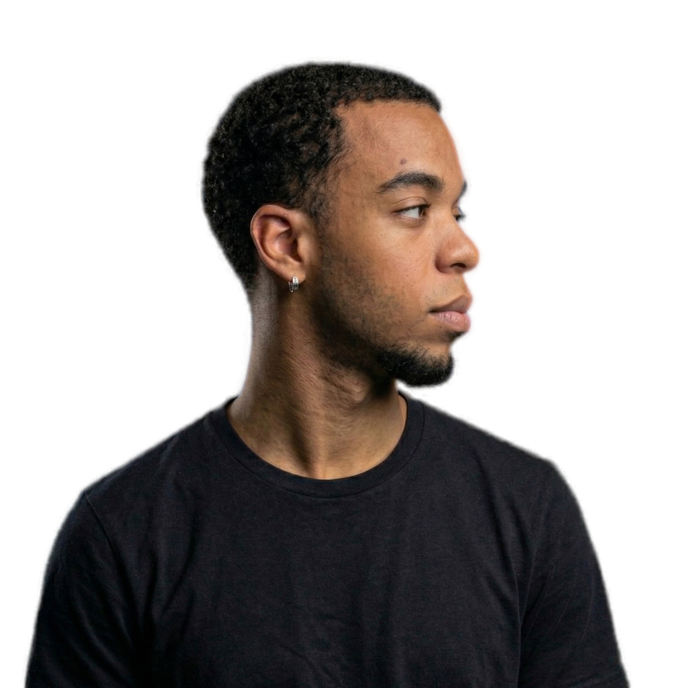
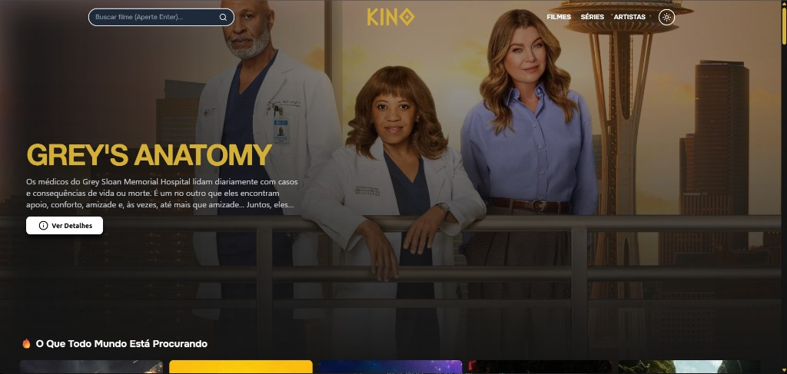
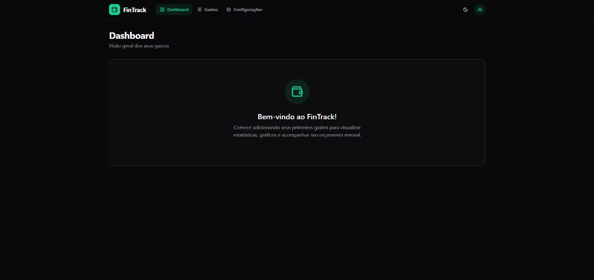
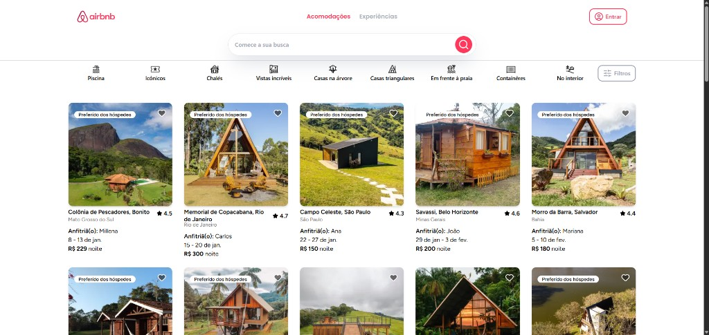

<div align="center">

# 💼 Portfólio João Gabriel Dev


[](https://joaogabriel.dev)
[](https://github.com/joaogabrieldev)
[](https://linkedin.com/in/joaogabrielrocha)

Portfólio pessoal com foco em front-end moderno, animações avançadas e apresentação de projetos/serviços.

</div>

---

## 📑 Índice

- [🌐 Deploy](#-deploy)
- [📖 Sobre](#-sobre)
- [🧱 Padrões e Fundamentos](#-padrões-e-fundamentos)
- [🛠️ Tecnologias e Bibliotecas](#️-tecnologias-e-bibliotecas)
- [🗂️ Estrutura do Projeto](#️-estrutura-do-projeto)
- [⚙️ Como rodar localmente](#️-como-rodar-localmente)
- [📌 Evento](#-evento)
- [👨‍💻 Contato](#-contato)

---

## 🌐 Deploy

Projeto em produção:

### 🔗 [https://joaogabriel.dev](https://joaogabriel.dev)

---

## 📖 Sobre

Este repositório contém meu site portfólio, desenvolvido para apresentar:

- projetos reais;
- stack técnica e habilidades;
- serviços/propostas para freelas;
- canais de contato profissional.

### 🖼️ Preview

<div align="center">
  
</div>

<div align="center">
  
  
  
</div>

---

## 🧱 Padrões e Fundamentos

O projeto segue fundamentos importantes de arquitetura front-end:

- **Arquitetura baseada em componentes** (componentes pequenos, reutilizáveis e compostos);
- **Separation of Concerns** (separação entre `sections`, `widgets`, `components`, `pieces`, `utils`);
- **Responsividade mobile-first** com utilitários do Tailwind;
- **Tipagem estática com TypeScript** para maior segurança e manutenção;
- **Organização por domínio visual** (seções de página + widgets de composição);
- **Padronização de código** com ESLint + Prettier.

> Caso este projeto faça parte de algum curso/evento específico, você pode atualizar a seção **Evento** abaixo.

---

## 🛠️ Tecnologias e Bibliotecas

<div align="center">
  
</div>

### 🚀 Stack principal

- **Next.js** (`16.1.0`)
- **React** (`19.2.3`)
- **TypeScript** (`^5`)
- **Tailwind CSS** (`^4`)

### 📚 Bibliotecas utilizadas

- **Animações/UI**: `framer-motion`, `motion`, `gsap`, `@gsap/react`, `lottie-react`
- **3D/visual**: `three`, `@react-three/fiber`, `@react-three/drei`, `@splinetool/react-spline`
- **Componentes e acessibilidade**: `@headlessui/react`, `@radix-ui/react-accordion`
- **Carrossel e interação**: `embla-carousel`, `embla-carousel-react`, `react-scroll`
- **Estado/utilitários**: `zustand`, `clsx`, `class-variance-authority`, `tailwind-merge`, `mathjs`
- **Contato/agendamento**: `@calcom/embed-react`
- **Ícones**: `lucide-react`, `react-icons`

### 🧪 Dev tooling

- `eslint`, `eslint-config-next`, `eslint-plugin-simple-import-sort`
- `prettier`, `prettier-plugin-tailwindcss`
- `vitest`, `@vitest/coverage-v8`, `@vitest/browser-playwright`

### 🧩 Ícones das stacks (estilo devicon/simpleicons)

<div align="center">
  
  
  
  
  
  
  
</div>

---

## 🗂️ Estrutura do Projeto

```bash
src/
├── app/             # Rotas e layout (Next App Router)
├── layout/          # Blocos de layout principais
├── sections/        # Seções da landing (Hero, About, Process, etc.)
├── widgets/         # Composições complexas de UI
├── components/      # Componentes reutilizáveis
├── pieces/          # Peças menores e especializadas
├── assets/          # Imagens, ícones, thumbs e dados estáticos
├── hooks/           # Hooks customizados
├── lib/             # Helpers compartilhados
└── utils/           # Utilitários gerais
```

---

## ⚙️ Como rodar localmente

### Pré-requisitos

- Node.js 18+
- `pnpm` (recomendado) ou `npm`

### Passos

```bash
git clone https://github.com/joaogabrieldev/portifolio-joaogabrieldev.git
cd portifolio-joaogabrieldev
pnpm install
pnpm dev
```

Aplicação local: `http://localhost:3000`

### Scripts úteis

- `pnpm dev` -> desenvolvimento
- `pnpm build` -> build de produção
- `pnpm start` -> iniciar build
- `pnpm lint` -> validação de código
- `pnpm storybook` -> Storybook local
- `pnpm build-storybook` -> build do Storybook

---

## 📌 Evento

**Evento/curso relacionado:** `não informado no repositório`

> Se quiser, substitua por algo como: `NLW`, `Imersão`, `Bootcamp` ou o nome do curso/evento real.

---

## 👨‍💻 Contato

<div align="center">

### João Gabriel R. Rocha

[](https://github.com/joaogabrieldev)
[](https://linkedin.com/in/joaogabrielrocha)
[](https://joaogabriel.dev)

</div>

---

<div align="center">
Feito com ❤️, Next.js e muito café.
</div>
